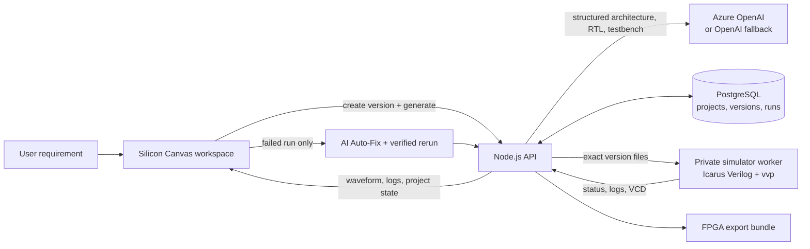
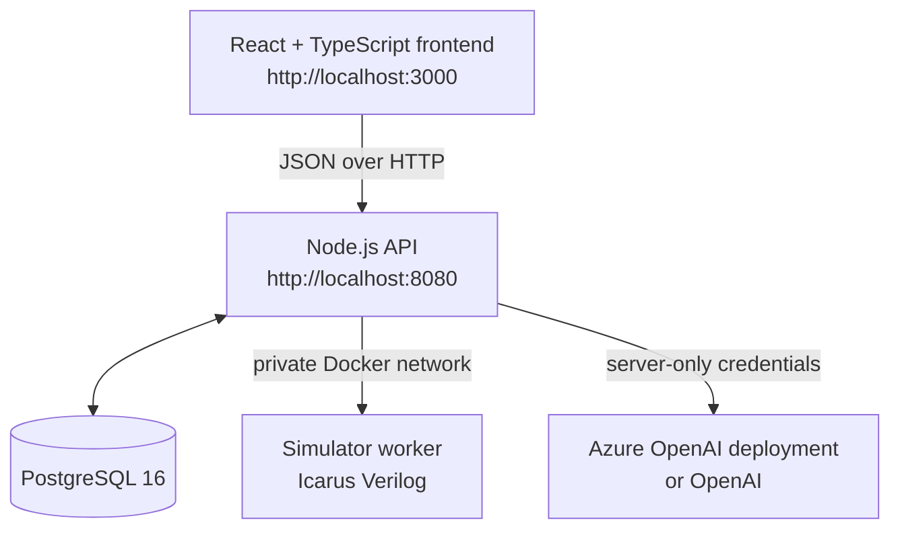

# Silicon Canvas

> **Describe hardware in plain English. Generate a design. Verify it with real simulation evidence. Repair safely.**

Silicon Canvas is an AI-assisted hardware-design workspace built for a hackathon submission. It turns a hardware requirement into a structured architecture, Verilog/SystemVerilog RTL, and a self-checking testbench; runs that exact saved version in an isolated Icarus Verilog worker; renders the resulting VCD waveform; and can create a separately verified AI repair when a simulation fails.

It is designed to make the hardware workflow understandable to both an HDL engineer and a hackathon evaluator: every major stage is visible in the product, saved as a project version, and backed by logs, waveform data, or a generated artifact bundle.

## Hackathon snapshot

| | |
| --- | --- |
| Problem | Hardware design has a slow loop between specification, RTL authoring, simulation, debugging, and FPGA handoff. |
| Solution | One browser workspace that connects prompt-to-architecture, RTL, testbench, simulation, repair, and export. |
| AI role | Azure OpenAI produces strictly structured architecture/RTL output, diagnoses failed runs, and explains the active project through Mentor. |
| Verification | Saved source is compiled with Icarus Verilog in a constrained worker; results include logs and VCD waveform evidence. |
| Current QA | 50/50 scoped integration and UI checks are recorded as passing in [docs/QA_50_TEST_CASES.md](docs/QA_50_TEST_CASES.md). |
| Featured Codex build session | `019f8055-658a-7343-9a73-60a52ce5be63` |

## Why Silicon Canvas

Hardware tools are powerful, but the journey from an idea to a checked design commonly crosses separate tools and requires deep HDL knowledge early. Silicon Canvas shortens that learning and iteration loop without treating AI output as automatically correct:

1. **Describe** the circuit in natural language.
2. **Generate** a structured architecture, RTL, and self-checking testbench.
3. **Inspect and edit** the source, the generated architecture, or a visual circuit schematic.
4. **Simulate** the exact saved version in a separate Icarus Verilog service.
5. **Read evidence** through compiler/runtime logs and an interactive VCD waveform viewer.
6. **Auto-Fix** a failed run into a new version, then accept it only if its own rerun passes.
7. **Export** a reproducible FPGA handoff bundle for a supported board.

## What is built

### Product workspace

- Prompt-first landing page with a clear hardware-design workflow.
- Monaco-based RTL editor with explicit save and autosave before simulation.
- Project persistence, active-project restore after browser refresh, and immutable version history/restore.
- Architecture view that turns the AI-generated module map, ports, connections, and verification plan into a visual graph.
- Circuit Designer with a component palette, typed ports, inspector, connection validation, undo/redo, and a deterministic schematic-to-Verilog compiler.
- Waveform view with real VCD data, signal filtering, zoom, time cursor, hexadecimal bus values, and simulation logs.
- 3D RTL Gates view for exploring generated topology.
- Copilot/Mentor experience with Architect, RTL Engineer, Verification, Debug, and Mentor roles.
- Project view for version history, AI usage totals, restore, and FPGA export artifacts.

### Persistent backend workflow

- PostgreSQL storage for projects, immutable-style design versions, source files, architectures, simulation runs, Auto-Fix attempts, export jobs, and AI usage events.
- Azure OpenAI integration (preferred) with public OpenAI API fallback. Keys stay server-side.
- Two structured model calls for generation: first architecture, then RTL/testbench file bundle.
- Server-side validation of file paths, file kinds, sizes, required RTL/testbench presence, and unsupported simulator constructs.
- Isolated Icarus Verilog simulation with compilation logs, runtime logs, VCD capture, bounded output, and run persistence.
- Verification-gated Auto-Fix: the original version remains intact and a repair is marked applied only after a fresh rerun passes.
- Project-context Mentor answers with a separate, auditable `mentor` AI-usage event.
- FPGA handoff artifacts for **IceStick**, **iCEBreaker**, and **Arty A7**.

## End-to-end workflow



The key rule is simple: **AI suggests; simulation verifies.** A generated design or repair is never presented as verified until the corresponding saved version has been compiled and executed.

## Architecture



| Layer | Technology | Responsibility |
| --- | --- | --- |
| Frontend | React 19, TypeScript, Vite, Zustand, Monaco, React Flow, Three.js | Design workspace, editing, graphs, waveform display, project controls. |
| API | Node.js HTTP server, PostgreSQL client | Versioning, validation, AI orchestration, simulation/export requests, usage audit. |
| AI | Azure OpenAI `gpt-5.4` deployment or OpenAI fallback | Structured architecture, RTL/testbench generation, Mentor, repair proposal. |
| Simulation | Icarus Verilog (`iverilog` + `vvp`) in a dedicated container | Compile and execute saved design files; return logs and VCD. |
| Data | PostgreSQL 16 | Projects, immutable version snapshots, files, runs, repairs, exports, token usage. |
| Deployment | Docker Compose + Nginx | One-command local stack with web, API, database, and internal simulator services. |

## Quick start

### Prerequisites

- Docker Desktop with Docker Compose
- An Azure OpenAI deployment **or** an OpenAI API key for AI generation, Mentor, and Auto-Fix

### 1. Configure server-side AI

Copy the example file and add your Azure values:

```powershell
Copy-Item backend/.env.example backend/.env
```

In `backend/.env`:

```dotenv
AZURE_OPENAI_API_KEY=your_key
AZURE_OPENAI_ENDPOINT=https://YOUR-RESOURCE-NAME.openai.azure.com
AZURE_OPENAI_DEPLOYMENT_NAME=gpt-5.4
```

Alternatively, configure `OPENAI_API_KEY` and the optional `ARCHITECT_MODEL` / `RTL_MODEL` values. Do **not** configure Azure and OpenAI credentials together, and never expose a key through a browser-side `VITE_*` variable.

### 2. Start the complete stack

```bash
docker compose --env-file backend/.env up --build
```

Open these URLs:

- Workspace: [http://localhost:3000](http://localhost:3000)
- API health: [http://localhost:8080/health](http://localhost:8080/health)

Expected health response:

```json
{
  "status": "ok",
  "service": "silicon-canvas-api",
  "database": "connected"
}
```

Stop the stack with `docker compose down`. Add `--volumes` only when you intentionally want to remove local PostgreSQL data.

### Without AI credentials

The visual Circuit Designer and its deterministic local schematic-to-Verilog compiler remain usable without model credentials. AI generation, Mentor, and Auto-Fix intentionally report that server-side AI is not configured rather than silently exposing a credential or fabricating an AI result.

## Evaluator demo path

This is a fast, reproducible walkthrough for a hackathon judge.

1. Open the workspace and enter: **“A 4-bit ALU with overflow detection.”**
2. Select **Generate design**. Inspect the generated architecture and source files.
3. In **Studio**, review or edit RTL in Monaco; save the active version.
4. Click **Simulate**. Open **Waveforms** to inspect the real VCD signals and run logs.
5. Use a deliberately failing testbench to reveal **Auto-Fix & rerun**. The result is saved as a new version and is marked successful only if the rerun passes.
6. Open **Project** to review immutable versions and model-token usage.
7. Open **FPGA export** and choose IceStick, iCEBreaker, or Arty A7 to create constraints, a `build.sh`, and a board-specific README.
8. Ask **Mentor** how the active design works; the response is based on the saved prompt and architecture, not browser-stored credentials.

## API overview

All API responses are JSON. Representative routes:

| Method | Endpoint | Purpose |
| --- | --- | --- |
| `GET` | `/health` | API process and database health. |
| `GET`, `POST` | `/api/projects` | List projects or create a project from a prompt. |
| `GET` | `/api/projects/:projectId` | Read active project/version metadata. |
| `POST` | `/api/projects/:projectId/generate` | Create architecture, RTL, and testbench for the active version. |
| `GET`, `POST` | `/api/projects/:projectId/versions` | List versions or create a new version. |
| `POST` | `/api/projects/:projectId/versions/:versionId/restore` | Clone an older version into a new active version. |
| `GET` | `/api/projects/:projectId/versions/:versionId` | Read all files for one version. |
| `PUT` | `/api/projects/:projectId/versions/:versionId/files/:path` | Save a source file. |
| `POST` | `/api/projects/:projectId/versions/:versionId/simulate` | Run the exact saved version in the simulator worker. |
| `POST` | `/api/projects/:projectId/simulations/:simulationId/auto-fix` | Diagnose, create a repair version, and rerun it. |
| `GET` | `/api/projects/:projectId/usage` | Return AI request events and token totals. |
| `POST` | `/api/projects/:projectId/mentor` | Ask about the active project with server-side context. |
| `POST` | `/api/projects/:projectId/versions/:versionId/exports` | Create a supported-board FPGA handoff bundle. |

For a complete API and data-model reference, read [docs/BACKEND_IMPLEMENTATION.md](docs/BACKEND_IMPLEMENTATION.md).

## Simulation safety and trust boundaries

Simulation runs are deliberately separated from the browser and API process.

- The simulator has no public port and is reachable only over Docker’s internal network.
- Its container is read-only, drops Linux capabilities, disables new privileges, uses a limited `/tmp` filesystem, and has CPU, memory, PID, and 15-second execution limits.
- Files are validated for count, size, safe paths, and blocked filesystem/process system tasks before compilation.
- Temporary simulation directories are deleted after every run.
- VCD and logs are bounded before persistence and before they become Auto-Fix context.
- Azure/OpenAI, database, and simulator configuration remain on the server; the frontend uses only the API base URL.

This is a hackathon prototype, not a multi-tenant production service. Authentication, authorization, rate limits, queues, and human review of repair diffs are the next important steps before public deployment.

## Verification

The project’s latest QA pass documents **50 scoped checks**, including Docker startup, migrations, generation, token usage, version restore, real simulation/VCD output, failed simulation, Auto-Fix rerun, unsafe-source rejection, waveform controls, circuit compilation, architecture, Mentor, 3D gates, and FPGA export.

```bash
npm run check
```

Use the complete Docker command above for integration verification. The test matrix and evidence are maintained in [docs/QA_50_TEST_CASES.md](docs/QA_50_TEST_CASES.md).

## Repository guide

```text
.
├── frontend/                         # React workspace and visual design tools
│   └── src/features/
│       ├── workspace/                # Studio orchestration and project state
│       ├── designer/                 # Visual circuit editor + deterministic RTL compiler
│       ├── waveform/                 # VCD waveform/log viewer
│       ├── architecture/             # AI architecture graph
│       ├── gates/                    # 3D RTL gates view
│       ├── project/                  # Versions, usage, and export UI
│       └── agents/                   # Mission control and Mentor
├── backend/
│   ├── src/                          # API, generation, simulation, repair, usage, export
│   ├── migrations/                   # PostgreSQL schema migrations
│   └── simulator-worker/             # Constrained Icarus Verilog HTTP worker
├── packages/
│   ├── shared/                       # Shared API/domain TypeScript contracts
│   └── vcd-core/                     # VCD parsing and waveform model utilities
├── docs/                             # Architecture, backend, QA, and demo materials
├── docker-compose.yml                # Web + API + database + simulator runtime
└── CODX_BUILD_LOG.md                 # Full Codex-assisted construction diary
```

## Documentation

- [Backend implementation](docs/BACKEND_IMPLEMENTATION.md) — runtime flow, API, schema, AI configuration, safeguards, and roadmap.
- [QA: 50 test cases](docs/QA_50_TEST_CASES.md) — checked capabilities and recorded results.
- [Architecture boundaries](docs/ARCHITECTURE.md) — package ownership and integration rules.
- [Demo outline](docs/DEMO_VIDEO.md) — suggested short technical demo sequence.
- [Codex build log](CODX_BUILD_LOG.md) — implementation diary, fixes, and evaluator evidence plan.

## What comes next

- Authentication, project ownership, and role-based access.
- Job queue, progress events, cancellation, and rate limits for long-running work.
- Human approval and visual diffs before accepting an AI repair.
- More HDL fixtures, top-module selection, and richer simulator telemetry.
- Optional vendor-toolchain workers for a real FPGA bitstream, beyond the current reproducible export bundle.

## License

Released under the [MIT License](LICENSE).
