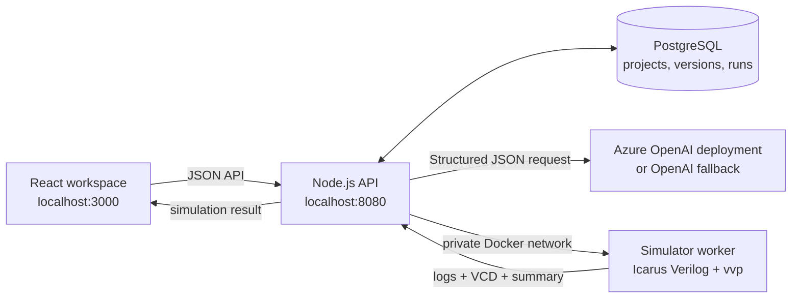

# Silicon Canvas backend: current implementation

Last updated: 21 July 2026

This document describes the backend that is implemented and running today. Silicon Canvas turns a hardware prompt into an architecture, Verilog/SystemVerilog RTL and a self-checking testbench; then it can simulate the design, display VCD waveform data, propose an AI repair, and produce an FPGA-export bundle.

## What is currently built

| Capability | Status | What it does |
| --- | --- | --- |
| Project and source persistence | Implemented | Stores projects, versioned design files, architecture JSON, simulation runs, repair attempts and exports in PostgreSQL. |
| AI design generation | Implemented | Uses Azure OpenAI (preferred) or the public OpenAI API fallback to create an architecture followed by an RTL/testbench file bundle. |
| Source editing | Implemented | Saves RTL, testbench and related source to the active version through the API. |
| Versioning and restore | Implemented | Creates incremental versions; restore creates a new copy rather than overwriting history. |
| Isolated Icarus simulation | Implemented | Sends a version’s files to a separate container running `iverilog -g2012` and `vvp`. |
| VCD persistence | Implemented | Collects `simulation.vcd`, stores up to 1 MB, and returns it to the frontend for waveform parsing. |
| AI Auto-Fix | Implemented | Supplies failed-run context to the model, creates a separate repaired version, reruns it, and marks it applied only when the rerun passes. |
| FPGA export preparation | Implemented | Produces supported-board constraints and reproducible build-script artifacts. |
| Health checks and migrations | Implemented | API health verifies PostgreSQL; migrations run before the HTTP server starts. |

## Runtime architecture



Docker services are defined in `docker-compose.yml`:

- `web`: the frontend on port `3000`.
- `api`: Node.js backend on port `8080`.
- `db`: PostgreSQL 16 with a persistent Docker volume.
- `simulator`: an internal-only Icarus worker; it has no public port.

## Backend request flow

### 1. Generate a design

1. The frontend creates a project with a prompt, or uses its active project.
2. `POST /api/projects/:projectId/generate` marks the active version as `running`.
3. `generation.mjs` calls the model twice:
   - Call 1 creates a validated architecture JSON document.
   - Call 2 uses that architecture to create RTL and at least one self-checking testbench.
4. The API validates file paths, file sizes, required file kinds and unsupported simulator features.
5. The architecture and files are saved to PostgreSQL; the project becomes `ready`.

If a call fails, the version is marked `failed` and the API returns a structured error.

### 2. Run a simulation

1. `POST /api/projects/:projectId/versions/:versionId/simulate` creates a simulation-run record.
2. The API obtains the exact files belonging to that version and calls the private simulator worker.
3. The worker creates a temporary directory, validates and writes the files, and adds a small VCD dump module.
4. It compiles using `iverilog -g2012`, then executes `vvp`.
5. The worker returns status, logs, a concise summary and VCD content. The temporary directory is deleted even if compilation or execution fails.
6. The API persists the result and the UI renders the logs or waveforms.

### 3. Auto-Fix a failed simulation

1. `POST /api/projects/:projectId/simulations/:simulationId/auto-fix` requires a failed run on the active version.
2. The backend builds a bounded context: run summary, last 20,000 characters of logs/VCD, and bounded source-file content.
3. The model returns a diagnosis and complete replacement content only for changed RTL/testbench files.
4. The backend clones the active version into a new version and writes the proposed changed files there.
5. It reruns the new version in the isolated simulator.
6. The repair attempt is saved as `applied` only if the rerun passes. Otherwise it is saved as `failed` with the diagnosis and rerun evidence; the original version remains unchanged.

## API reference

All API responses are JSON. Errors use this shape:

```json
{
  "error": {
    "code": "VALIDATION_ERROR",
    "message": "Prompt is required."
  }
}
```

| Method | Endpoint | Purpose |
| --- | --- | --- |
| `GET` | `/health` | Confirms API process and PostgreSQL connectivity. |
| `GET` | `/api/projects` | Lists projects. |
| `POST` | `/api/projects` | Creates a project from `{ "prompt", "name"? }`. |
| `GET` | `/api/projects/:projectId` | Returns active project/version metadata. |
| `POST` | `/api/projects/:projectId/generate` | Generates architecture, RTL and testbench for the active version. |
| `POST` | `/api/projects/:projectId/versions` | Creates a version; accepts `{ "prompt"?, "copyFiles"? }`. |
| `GET` | `/api/projects/:projectId/versions` | Lists all project versions. |
| `GET` | `/api/projects/:projectId/versions/:versionId` | Reads files for one version. |
| `POST` | `/api/projects/:projectId/versions/:versionId/restore` | Clones an earlier version into a new active version. |
| `PUT` | `/api/projects/:projectId/versions/:versionId/files/:path` | Saves a file to the active version. |
| `POST` | `/api/projects/:projectId/versions/:versionId/simulations` | Creates a simulation record for a browser/remote runner. |
| `POST` | `/api/projects/:projectId/versions/:versionId/simulate` | Runs the exact version with the Icarus container. |
| `GET` | `/api/projects/:projectId/simulations/:simulationId` | Reads one persisted simulation. |
| `POST` | `/api/projects/:projectId/simulations/:simulationId/complete` | Stores a browser-run result, logs and VCD. |
| `POST` | `/api/projects/:projectId/simulations/:simulationId/auto-fix` | Creates, applies and verifies an AI repair. |
| `POST` | `/api/projects/:projectId/versions/:versionId/exports` | Creates supported FPGA-board export artifacts. |

## Data model

The initial migration is `backend/migrations/001_initial_schema.sql`.

| Table | Why it exists |
| --- | --- |
| `projects` | Project name, prompt, overall status and active version. |
| `design_versions` | Immutable-style numbered snapshots containing a prompt, architecture and generation status. |
| `design_files` | Version-owned source files with path, language, kind and content. |
| `simulation_runs` | Runner, status, summary, logs, VCD and timestamps. |
| `auto_fix_attempts` | Repair status, diagnosis, JSON patch and resulting version. |
| `export_jobs` | FPGA target board, output artifacts and completion state. |

## AI provider configuration

Create `backend/.env` from `backend/.env.example` and set exactly one provider:

```dotenv
AZURE_OPENAI_API_KEY=...
AZURE_OPENAI_ENDPOINT=https://YOUR-RESOURCE-NAME.openai.azure.com
AZURE_OPENAI_DEPLOYMENT_NAME=gpt-5.4
```

The backend uses the deployment endpoint for Azure, so the model name is selected through `AZURE_OPENAI_DEPLOYMENT_NAME`. Alternatively, `OPENAI_API_KEY` can be used as a fallback. Configuring both is deliberately rejected. Credentials remain in the API container and must never be prefixed with `VITE_`.

Start the complete stack with:

```bash
docker compose --env-file backend/.env up --build -d
```

Check it with:

```bash
curl http://localhost:8080/health
npm run check
```

## Token usage: current answer

**There is no exact historical token total available in the current implementation.** The AI provider usually returns token-usage metadata, but `requestStructuredModel` currently reads only the model message content and does not persist `usage` to PostgreSQL or logs. Therefore, neither an accurate number nor a cost estimate can be reconstructed after the fact.

What can be stated exactly:

| Operation | Model calls made |
| --- | --- |
| Successful **Generate** action | 2 calls: architecture, then RTL/testbench. |
| Successful **Auto-Fix** request | 1 call: diagnosis and replacement files. |
| Simulation, source saving, version restore and FPGA export | 0 model calls. |

The input is intentionally bounded before an Auto-Fix call: logs/VCD are each limited to the last 20,000 characters and each source file is limited to 150,000 characters. This limits accidental oversized requests, but character limits are not a token count.

### Required change for exact token reporting

Add an `ai_usage_events` table with: operation (`architecture`, `rtl`, `auto_fix`), provider, deployment/model, `prompt_tokens`, `completion_tokens`, `total_tokens`, optional cost, project/version/repair IDs and timestamp. Then, in `requestStructuredModel`, record the provider response’s `usage` object for every successful request. A dashboard query can then show total tokens and cost per project, version and date range without storing API keys or duplicate prompt content.

## Improvements completed so far

### Reliability and correctness

- Two-stage structured AI generation: architecture first, implementation second.
- Strict JSON-schema output contracts and server-side file validation.
- Icarus-compatible generation rules; unsupported constructs such as `inside`, `unique`, `priority`, UVM, classes and randomization are rejected.
- Signed finite-width overflow guidance was corrected for both generation and Auto-Fix, avoiding invalid unbounded-integer comparisons.
- Auto-Fix is verification-gated: a patch is not considered successful until its fresh simulation passes.
- Auto-Fix persists JSON patches correctly and records the result version.
- Version restore clones files into a new version, preserving earlier work rather than overwriting it.
- Failure paths update generation, simulation and repair records with useful status and logs.

### Simulation safety

- Simulator runs in a separate, internal Docker service with no public port.
- Container is read-only with a limited `/tmp` `tmpfs`, no new privileges, all Linux capabilities dropped, CPU/memory/PID limits and a 15-second process timeout.
- Request body, source-file count, source-file size, output-log size and VCD size have explicit bounds.
- Path traversal is rejected and temporary workspaces are removed after every run.
- Dangerous filesystem-related Verilog system tasks are blocked before execution.

### Product experience

- Persisted project files, VCD and simulation logs survive the browser session.
- Waveform/log output is integrated with the workspace.
- Architecture graph and full Architecture view are available alongside the editor.
- The workspace layout was restored to the spacious three-column view: prompt/files, source editor, waveform plus graph.
- FPGA export endpoints now prepare target-specific output artifacts for supported boards.

## Recommended next improvements

1. Implement the token/cost audit described above, then display per-project usage in the UI.
2. Add authentication, project ownership and per-user authorization before deployment beyond local development.
3. Add rate limits and quotas for generation, simulation and Auto-Fix.
4. Run long generation/simulation/export work through a persistent job queue with cancellation and progress events.
5. Store source diffs for Auto-Fix and show a human review/approve step before making a repaired version active.
6. Add API and integration tests for generation failures, malicious simulation input, version restore and Auto-Fix reruns.
7. Add simulator resource telemetry (compile/run duration, memory outcome, timeout reason) and a clearer top-module selection mechanism.
8. Add a real FPGA build worker if board toolchains should execute in the product; current export creates the reproducible artifact bundle.

## Relevant source files

| Area | File |
| --- | --- |
| HTTP routes and orchestration | `backend/src/server.mjs` |
| Configuration | `backend/src/config.mjs` |
| PostgreSQL connection/migrations | `backend/src/db.mjs` |
| Projects, files and versions | `backend/src/projects.mjs` |
| AI architecture/RTL generation | `backend/src/generation.mjs` |
| AI repair generation | `backend/src/autofix.mjs` |
| Simulation/Auto-Fix persistence | `backend/src/simulations.mjs` |
| Simulator HTTP client | `backend/src/simulator-client.mjs` |
| Isolated Icarus worker | `backend/simulator-worker/server.mjs` |
| FPGA artifact generation | `backend/src/exports.mjs` |
| Database schema | `backend/migrations/001_initial_schema.sql` |
